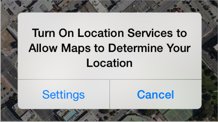

## 3.17 访问用户数据(Accessing User Data)
位置服务允许应用获取用户当前大致的地理位置，设备指向的方向以及用户移动的方向。其他系统服务，例如通讯录、日历、备忘录和相册等，同样也允许应用访问用户存储在里面的数据。

虽然获取了用户数据的应用能带来一定的方便，但还是需要为用户提供维持信息私密性的功能。例如，用户喜欢应用自动给内容加上位置标签，或者可以找到附近的好友，但用户也需要能在不想分享位置的时候关闭这些功能。(想要学习如何给应用增加获取位置功能，请参阅 [Location and Maps Programming Guide](https://developer.apple.com/library/ios/documentation/userexperience/conceptual/LocationAwarenessPG/Introduction/Introduction.html#//apple_ref/doc/uid/TP40009497).)

以下几点可以帮助您以用户不反感的方式获取用户数据。

**确保使用户理解分享私人数据的原因。**如果没有明显的需要，用户自然会对私人信息的请求感到怀疑。为了避免用户反感，确保在用户使用明显需要个人信息的功能时再进行提醒。例如，即使没有打开位置服务用户也可以使用地图，但是在用户使用定位或导航功能时就会有提醒。

**应用需要个人信息的原因不明显时向用户做出解释。**你可以在提醒框中给出文字性的描述，例如“这个应用需要访问你的通讯录”或者“是否允许应用获取你的地理位置？”。这些文案最好明确且有礼貌以让用户无压力的理解为什么需要访问他们的信息。

讲述原因的文案应该遵循以下原则：

- 不要包含你的应用名称，因为系统提供的提醒框已经包含了。
- 清楚地描述你的应用为什么需要这些数据。如果可以的话，你也可以解释不会用这些数据做什么。
- 使用以用户为中心的术语并且进行本地化。
- 在易于理解的情况下越短越好。尽可能避免超过一句话。
- 使用句式大小写(sentence-style capitalization).(句式大小写指的是第一个单词大写，除了专有名词和专有形容词以外的词都小写。)
**只有当你的应用没有用户数据就无法提供基础服务时，才在一开始就征求用户的许可。**如果你的应用在知道了用户私人信息后才能提供主要功能是显而易见的话，用户不会因此觉得烦扰。

**避免在用户选择需要数据的功能之前调用触发提醒框的程序。**这样，就可以避免用户疑惑为什么在使用不需要私人数据的功能时有请求提醒。(注意，检查用户位置服务的设置并不会触发提醒。)

**检查位置服务的设置来避免触发没必要的提醒。**你可以使用核心位置的程序接口来实现(想要学习如何做，请参阅 [Core Location Framework Reference](https://developer.apple.com/library/ios/documentation/CoreLocation/Reference/CoreLocation_Framework/index.html#//apple_ref/doc/uid/TP40007123)).使用这些知识，可以尽可能地在使用需要位置信息的功能时才进行提醒，或者完全避免提醒。