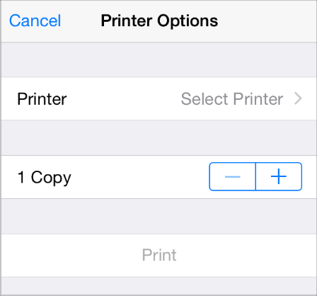

## 3.16 无线打印 (AirPrint)
用户可以通过 AirPrint 无线打印应用中的内容，还可以使用打印中心应用检查打印任务。

你可以利用内置的支持程序来打印图片和 PDF 文件，或者可以使用特定的打印程序接口来完成自定义的格式设置和渲染设置。iOS 可以处理打印机的发现、任务排序以及在指定打印机上执行打印任务。

通常来讲，用户想要打印文件的时候，只需要点击应用中的标准动作按钮(Action button)。当他们在界面视图中选择了要打印的项目后，可以接着选择打印机，设置打印属性，最后点击打印按钮开始打印。

打印中心应用是一个只有在处理打印任务时才可见的后台系统应用，用户可以用它来查看打印任务。用户可以在打印中心浏览当前打印队列，查看某个打印任务的详情，还可以取消某个任务。

只需添加少量代码就可以支持基本打印功能 (想要了解在代码中添加打印功能，请查看 [Drawing and Printing Guide for iOS](https://developer.apple.com/library/ios/documentation/2DDrawing/Conceptual/DrawingPrintingiOS/Introduction/Introduction.html#//apple_ref/doc/uid/TP40010156)).想要确保好的打印体验，可以遵循以下几点规范：

**使用系统提供的动作按钮。**用户对系统提供的按钮的含义和行为都很熟悉，所以尽可能的使用系统动作按钮。如果你的应用没有工具栏或导航栏，那就要另当别论了。在这种情况下，你就需要自己设计一个可以出现在应用主界面的打印按钮，因为动作按钮只能在工具栏和导航栏中使用。

**在当前情境下打印操作是基本功能时才显示打印项(Print item).如果当前情境并不适合打印，或者用户并不想打印，就不要在由动作按钮显示的视图中将打印项显示出来。**

**合适的话，给用户提供更多打印选项。**例如，让用户设置打印页码范围或打印份数。

**如果用户不能打印，则不要显示特定的打印用户界面。**在向用户展示有打印项的界面前，确保用户的设备是支持打印的。想要了解如何在代码中实现，请查看 [UIPrintInteractionController Class Reference](https://developer.apple.com/library/ios/documentation/UIKit/Reference/UIPrintInteractionController_Class/index.html#//apple_ref/doc/uid/TP40010141).