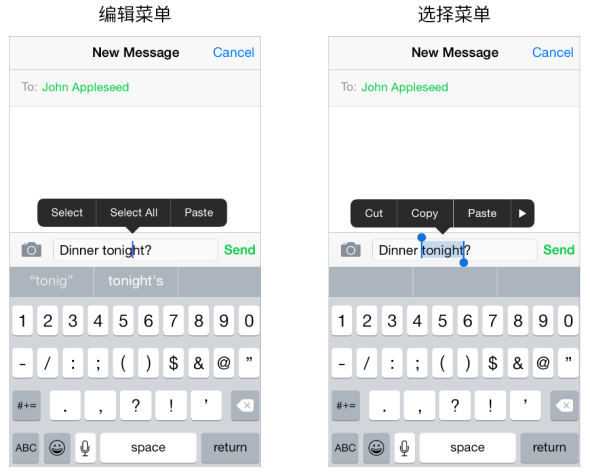

## 3.22 编辑菜单(Edit Menu)
用户能呼出一个编辑菜单来完成诸如在文本视图、网页或图片视图中的剪切、粘贴以及选择操作。

你可以通过调整一些菜单的行为使用户对你应用中的内容有更多的控制权。举个例子，你可以：

- 列举出适用于当前情境的标准菜单的命令
- 在菜单显示前判定菜单的位置，以避免你应用的用户界面中的重要信息被遮盖
- 定义当用户双击展开菜单时会被默认选中的对象
你不能改变菜单本身的颜色和形状。

欲了解如何在代码中实现这些行为的相关信息，请参阅 [Copy, Cut, and Paste Operations](https://developer.apple.com/library/ios/documentation/StringsTextFonts/Conceptual/TextAndWebiPhoneOS/UsingCopy,Cut,andPasteOperations/UsingCopy,Cut,andPasteOperations.html#//apple_ref/doc/uid/TP40009542-CH11).

为了确保编辑菜单在你的应用中的表现符合用户期望，你应该：

**显示在当前情境下合理的命令。**例如，当没有对象被选择的时候，菜单中不应该包括复制或剪切(命令)，因为这些命令是针对选择(的内容)而操作的。相似地，如果有对象被选择的时候，菜单中不应该包括选择(命令)。如果你在自定义页面中支持编辑菜单，你就有责任确保菜单中显示的命令切合当前的情境。

**依据你的页面布局调节菜单显示。**iOS 依据可获得的空间大小选择在插入点的上方或下方来放置菜单指针以显示编辑菜单，这样用户就能看到菜单命令是如何与内容相关的。在必要的情况下，你可以通过程序在菜单显示之前决定它的位置，这样可以避免用户界面中的重要信息被遮挡。

**支持两种手势来调用菜单。**虽然点击和长按手势是用户呼起编辑菜单的首选方式，但他们也可以在文本页面中通过双击一个单词来选择该单词并同时呼起菜单。如果你在自定义页面中支持菜单，确保它能支持两种手势。除此之外，你可以定义用户双击时默认的选择对象。

**避免在你的用户界面中创建和编辑菜单中功能相同的按钮。**例如，使用编辑菜单让用户进行复制操作远比提供一个复制按钮要好，因为用户将会想知道为什么在你的应用中会有两种方法做同样的事。

**如果静态文本的选择对用户来说是有用的，那么可以考虑使用它。**用户可能想要复制图片的标题，但他们不可能想复制选项卡的标签或是屏幕的标题，比如“账户(Account)”。在文本页面内，文字的选择应该是默认设置的。

**不要使按钮标题可选择。**如果按钮的标题是可选择的，用户很难在不激活按钮的情况下呼出编辑菜单。通常来说，像按钮这样操作的元素不需要是可选择的。

**将对撤销与重做的支持与对复制与粘贴的支持组合到一起。**人们经常希望在他们改变主意的时候能撤销最近的操作。由于编辑菜单在它操作执行的时候是不需要确认的，你应该给用户提供撤销或重做这些操作的机会。

如果你需要创建自定义的编辑菜单项，需要像下面展示的这个例子一样遵循这些指导原则：

**创建直接作用于用户选择的包含编辑、修改或其他操作的编辑菜单。**人们期望在当前的情境内用标准的编辑菜单项操作文本或对象，那么你的自定义菜单项最好能有相似的表现。

**将自定义项列在所有系统提供的项的后面。**不要将你的自定义项与系统提供的项混置在一起。

**保持自定义菜单项的数量在合理的范围内。**你不应该用太多选择迷惑你的用户。

**使用简洁的名称命名你的自定义菜单项**并确保名称能准确的描述命令的作用。通常，项的名字应该是一个可以描述行为如何执行的动词。虽然你通常会使用单个的大写单词作为名字，但如果你必须使用一个短语(作为名字)时，就应使用标题式大写短语。(简洁的、标题性的大写词就是将除了文章、四字及四字以下的并列连词与介词之外的单词都大写。)