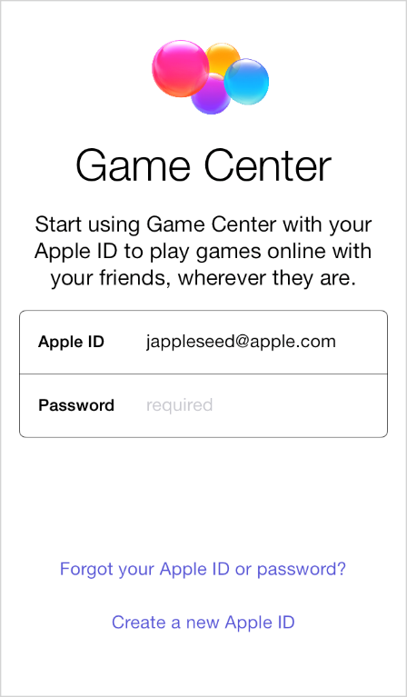

## 3.14 游戏中心(Game Center)
游戏中心给用户提供玩游戏、组织多人在线游戏以及其他更多功能。玩家可以使用内置的游戏中心应用来注册账户、发现新游戏、添加好友、浏览玩家排名和战绩。

作为一名游戏开发人员，你可以使用 GameKit 应用接口来发布分数和战绩到游戏中心的服务器上，在你的游戏页面中显示玩家排名，帮助用户找到其他玩家。想要了解如何将游戏中心集成到你的应用中，请查看 [Game Center Programming Guide](https://developer.apple.com/library/ios/documentation/NetworkingInternet/Conceptual/GameKit_Guide/Introduction/Introduction.html#//apple_ref/doc/uid/TP40008304).

遵循以下几点规范，有助于你的应用给用户提供好的游戏中心体验。

**不要使用自定义的用户界面来提示用户登录到游戏中心。**如果用户在未登录到游戏中心的情况下打开了一个需要启用游戏中心的应用，系统会自动提醒他们去登录。所以没必要自定义一个登录界面，而且有可能还会让用户感到困惑。

**一般情况下，使用标准的游戏中心界面。**在少数情况下，可能自定义游戏中心的界面是合理的，但是这样做会有让用户感到困惑的风险。标准的游戏中心界面对于 iOS 和 OS X 的用户是熟悉的，而且它会给用户一种置身于一个庞大游戏社区的感觉。

**允许用户关闭语音聊天。**有些用户可能不想在进入游戏时就自动开启语音聊天，而且大多数用户希望在特定情境下可以关闭语音聊天。