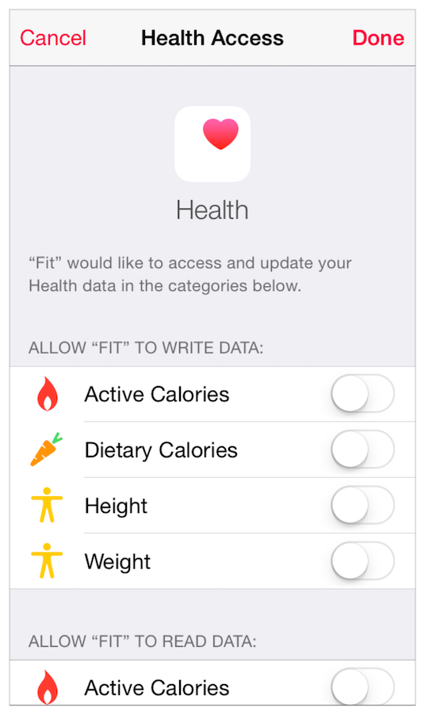

## 3.12 HealthKit
在 iOS 8 及之后的版本中，使用 HealthKit 构建的应用可以利用从健康应用中获取的数据为用户提供更强大、更完整的健康及健身服务。在用户允许的情况下，应用可以通过 HealthKit 来读写健康应用(用户健康相关数据的存储中心)中的数据。

举例来说，用户可以允许营养应用从健康应用中获取体重及活动数据，用于告诉他们为了达到既定目标一天应该消耗多少卡路里。这个营养应用还可以通过 HealthKit 更新健康应用上实际消耗的卡路里数据，让用户能更容易地跟踪他们的健康计划的进展。想要了解如何将 HealthKit 整合进你的应用中，请参阅 [HealthKit Framework Reference](https://developer.apple.com/library/ios/documentation/HealthKit/Reference/HealthKit_Framework/index.html#//apple_ref/doc/uid/TP40014707).

下面的指南能够帮助你设计出让人信任且喜爱的健康类应用：

**当且仅当你有令人信服的理由时才去访问健康应用中的数据。**HealthKit 是为了专注于健康及健身服务的应用而设计的。如果一个应用请求获取与其不相关的健康信息，用户不太可能会放心地将个人数据提供给这个应用。因此，你需要确保用户能够理解你的应用需要获取他们某些具体的个人健康数据的原因，并告诉他们共享这些数据的好处。

**避免在用户还不知道用途前就向他们请求访问私人健康数据。**当用户能够看到当前的任务和你需要访问的数据的关联性时，会更乐意给予你访问权限。举例来说，当用户在给一个减肥应用填写资料时，让他允许你访问健康应用中储存的体重数据是合理的。但如果那个减肥应用在启动时就立即提出访问体重数据的请求，用户更可能会选择拒绝分享该个人数据。

**使用系统提供的用户界面来请求访问用户的数据。**当用户想要向应用授予访问他们的数据的权限时，一般会期望看到如下图所示的系统权限许可列表。为了确保给用户提供良好的用户体验，应避免在应用的其他页面中重复使用权限许可列表上的信息。而是应该在权限列表中添加些自定义信息来说明为什么你的应用需要访问特定的数据(参阅 [HKHealthStore Class Feference](https://developer.apple.com/library/ios/documentation/HealthKit/Reference/HKHealthStore_Class/index.html#//apple_ref/doc/uid/TP40014708) 可获取更多信息)的原因。确保这些信息简洁且能清晰地说明你的应用是如何利用健康应用中的数据，以及收集这些数据的好处。

>注意：当用户决定停止与你的应用共享数据时，让他们可以在系统设置中即可完成变更，而不需要通过你的应用界面。

**不要在你的应用界面中使用健康应用的图标、图片或者截图。**和苹果所有的系统设计一样，这些图像都是受到版权保护的，不应该在你的应用中出现。

**不要在你的应用中使用“HealthKit”这个专用术语。**HealthKit 是代表能够获取健康应用中储存的数据的技术框架的专用技术术语。如果你需要向用户解释你的应用和健康应用中的数据的联系，请使用“健康应用”这个用语。例如，你可以说你的应用“将保存信息至健康应用中”或“所使用的数据是从健康应用中获取的”。