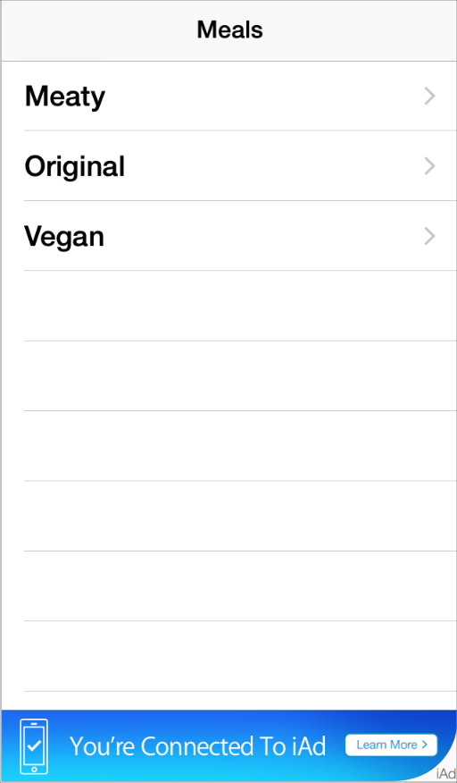

## 3.15 iAd 富媒体广告(iAd Rich Media Ads)
如果你允许你的应用中出现广告，那么你可以通过用户浏览或者点击这些广告获得收益。(如图所示，这个底部预留位置就是用来放置 iAd 横幅广告。)

通过 iAd 网络你可以在你的用户界面中以特定的视图投放一则广告。最初，这种视图可以用来承载目标横幅广告，起到引导用户进入查看全面广告详情的作用。当用户点击该横幅广告时，广告就会执行预先设定的动作，例如播放一段影片、展示可交互的内容，或者启动 Safari 打开目标网页。该动作所展示的内容可以遮挡住你当前的用户界面，或者使你的应用转换到后台运行。

有三种类型的横幅广告供你在应用中使用：标准(standard)、中等矩形(medium rectangle) 和全屏(full screen)。所有类型的横幅虽然在外观和行为上存在差异，但都提供同样的功能，就是引导用户进入广告。

**标准横幅(standard banner)**占用屏幕较少的空间，通常从始至终都可见。你可以选择在应用的哪些页面展示标准横幅，并在给这些页面设计布局时预留出空间。

所有的 iOS 应用都可以展示标准横幅。你可以使用 [ADBannerView](https://developer.apple.com/library/ios/documentation/UserExperience/Reference/ADBannerView_Ref/index.html#//apple_ref/occ/cl/ADBannerView) 类中的广告视图来显示标准横幅广告。

**中等矩形横幅 (medium rectangle banner)** 的行为同标准横幅类似，同样也可以选择展示中等矩形横幅的位置。

中等矩形横幅只能在 iPad 的应用中使用。你可以使用 [ADBannerView](https://developer.apple.com/library/ios/documentation/UserExperience/Reference/ADBannerView_Ref/index.html#//apple_ref/occ/cl/ADBannerView) 类中的广告视图来显示中等矩形横幅广告。

**全屏横幅 (full screen banner)** 会占用屏幕的大部分甚至是全屏空间，并且通常只在应用程序流的特定时间或特定位置显示。你可以选择使用模态视图来显示横幅广告，或者用独立页来展示可滚动的广告内容。(在下面的示例中，应用提供了一种杂志阅读的体验，通过翻页离开或回到全屏广告页面。)

你可以使用 [ADInterstitialAd](https://developer.apple.com/library/ios/documentation/iAd/Reference/ADInterstitialAd_Ref/index.html#//apple_ref/occ/cl/ADInterstitialAd) 类中的广告视图在你的应用中显示全屏横幅广告。

iAd 框架包含了所有类型的横幅广告，并且会在右下角显示 iAd 的标识。iAd 框架的设计固定在屏幕底部时看起来效果最佳。

为了保证广告无缝植入，并且要提供最好的用户体验，可以遵循以下几点规范。

**将标准横幅广告视图尽量放置在屏幕底部或底部附近。**这个位置的差别取决于屏幕底部是否包含栏(bar)以及是什么样的栏。

**将中等矩形横幅广告视图放置在不会干扰内容的地方。**和标准横幅一样，中等矩形横幅也最好放置在屏幕底部或底部附近。放在底部附近也能减少干扰用户的可能性。

**当用户体验存在中断时请使用模态视图来展示全屏横幅广告。**如果你的应用中有自然中断或情景转换，用模态样式来展示会更合适。当你使用模态样式来展示全屏横幅时(通过用 [presentFromViewController](https://developer.apple.com/library/ios/documentation/iAd/Reference/ADInterstitialAd_Ref/index.html#//apple_ref/occ/instm/ADInterstitialAd/presentFromViewController:) 实现)，用户要么进入广告，要么关闭它。出于这个原因，当用户有做出转变的预期时 (比如完成了一个任务后) 用模态视图的形式来展示比较好。

**应用的界面视图进行转场切换时不要使用模态样式展示全屏横幅。**如果用户在使用你的应用时会频繁的进行屏幕切换操作，例如杂志翻页或翻阅一些画册图片合集，此时使用非模态的形式会更合适。当你使用非模态来显示全屏横幅时(通过使用 [presentInView](https://developer.apple.com/library/ios/documentation/iAd/Reference/ADInterstitialAd_Ref/index.html#//apple_ref/occ/instm/ADInterstitialAd/presentInView:) 实现)，可以在用户界面中保留栏 (bar) 使得用户可以通过应用中的控件进入或退出广告。同其他横幅广告一样，点击全屏横幅广告也会触发 iAd 体验，但是如果条件允许的话，你的应用也可以对横幅广告区域支持其他手势操作 (比如拖动或滑动)。

确保使用合适的动画效果来显示和隐藏非模态的全屏横幅视图。例如，杂志阅读应用可以用和杂志翻页一样的动画效果。

**确保横幅广告在应用中出现的时间和位置是合理的。**用户只有在不觉得广告会打扰他们正常的工作流程时才有可能去体验 iAd.这点对于游戏这样的沉浸式应用尤其重要：你肯定不想将横幅放置在影响用户玩游戏的位置。

**避免将横幅放置在用户只会一扫而过的页面。**最好不要将横幅广告放置在用户会快速略过的页面，比如用户正要深入挖掘或前往他们所关注的内容。通常用户在一个页面停留至少1、2秒后才有可能会点击广告。

**尽可能的支持双向展示横幅广告。**最好让用户在使用应用时不必旋转设备就能浏览广告。当然，支持双向也能给你的广告提供更大的展示区域。想要了解如何确保转换方向时横幅广告能正常响应，请查看 [iAd Programming Guide](https://developer.apple.com/library/ios/documentation/UserExperience/Conceptual/iAd_Guide/Introduction/Introduction.html#//apple_ref/doc/uid/TP40009881).

**不要让标准或中等矩形横幅广告滚出屏幕。**如果你的应用需要滚动来展示更多内容，确保横幅广告一直固定在它的位置上。

**当用户浏览或与广告进行交互时，暂停那些吸引用户注意力或需要操作的活动。**当用户选择浏览广告时，他们不想因此错过应用中正发生的事件，也同样不想让应用打断广告体验。一个好的经验方法是像应用程序转入后台运行那样暂停当前活动。

**除非有特殊情况，否则不要中断广告。**一般情况下，当用户浏览并与广告进行交互时，应用还是会继续运行并接收事件，所以也有可能突然出现一个事件需要获得用户的注意力。然而，需要打断广告的场景其实非常少。有一种情景是有的应用会提供互联网语音协议服务(VoIP).在这种应用中，有电话接入时可能会取消正在运行的广告。

>注意:取消广告可能会对应用能接受的广告类型以及能获取的收益有不好的影响。