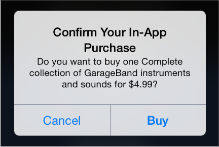

## 3.13 应用内购买服务(In-App Purchase)
应用内购买服务使得用户可以在你的应用中、你所设计的商店中购买到数字产品。

例如，用户可以做这些事：

- 将一个应用从基础版本升级到高级版本。
- 每月订阅新内容。
- 购买虚拟商品，比如游戏中的等级或道具。
- 购买并下载新的书籍。

你可以使用 StoreKit 框架以嵌入的方式将商店添加到你的应用中，并且用来支持应用内购买服务。当用户进行购买时，StoreKit 会连接到应用商店进行安全支付，然后再告知你的应用以便它可以提供用户已购买的商品。

>重要:应用内购买服务只提供支付功能，其他功能由你自己提供，例如向用户展示商品，解锁内置功能，从你自己的服务器上下载内容等等。当然，你所提供的所有商品都必须在应用商店注册过。

>想要了解关于在应用中添加商店的技术要求，请查看 [In-App Purchase Programming Guide](https://developer.apple.com/library/ios/documentation/NetworkingInternet/Conceptual/StoreKitGuide/Introduction.html#//apple_ref/doc/uid/TP40008267).想要了解更多关于应用内购买的商业需求信息，请查看 [App Store Resource Center](http://developer.apple.com/appstore/).当然，你还应该查看相关许可协议来确定你的应用可以出售哪些商品以及如何提供商品。

遵循以下几点规范，可以帮助你设计出用户喜欢的购买体验。

**将商店的使用体验优雅地集成到你的应用中。**在展示商品和处理交易时，给用户提供一种熟悉、一致的体验。你一定不希望用户在访问你的商店时感觉像是进入别的应用。

**使用简单明了的标题和说明。**最好能让用户在扫过一组项目时，可以快速发现感兴趣的内容。文案上不要截断隐晦，简单直白的语言和标题更容易让用户理解你所要展示的商品。

**不要更改默认的确认对话框。**当用户购买一个商品时，StoreKit 会提供一个确认对话框(如上图所示)。这个确认对话框可以帮助用户避免买错东西，所以不要修改它。