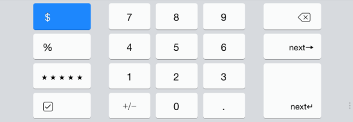

## 3.24 键盘和输入页面(Keyboards and Input Views)
在 iOS8 与之后的系统中，你可以创建自定义的键盘扩展内容来替代系统的原生键盘。欲了解更多关于管理应用内扩展(包括键盘)的信息，请参阅 [APP Extensions](https://developer.apple.com/library/ios/documentation/userexperience/conceptual/mobilehig/AppExtensions.html#//apple_ref/doc/uid/TP40006556-CH67-SW1)；欲了解如何开发自定义的键盘扩展内容的信息，请参阅 [Custom Keyboard](https://developer.apple.com/library/ios/documentation/General/Conceptual/ExtensibilityPG/Keyboard.html#//apple_ref/doc/uid/TP40014214-CH16).

在合适的情况下，你9也可以在你的应用内设计自定义的输入页面来替代系统原生的屏幕键盘。例如，Numbers(译者注：iWork 中的电子表单应用程序)中提供了多种输入页面，这些页面设计使数量、日期和其他值的输入能简单高效地完成。

如果你提供自定义输入页面，确保它的功能对于来用户来说是清晰易懂的。

你也可以提供自定义的输入辅助视图，这种视图通常表现为显示在键盘(或你的自定义输入页面)上方的一个独立元素。例如，在某些情境中，Numbers 会显示一个输入辅助视图用以帮助用户执行针对电子表格中的值的标准或自定义计算。

当用户在你的输入页面中敲击自定义控件时，使用标准的键盘敲击声提供声音反馈。欲了解在代码中如何使用这一声音，请参阅 [UIDevice Class Reference](https://developer.apple.com/library/ios/documentation/UIKit/Reference/UIDevice_Class/index.html#//apple_ref/doc/uid/TP40006902) 中的 [playInputClick](https://developer.apple.com/library/ios/documentation/UIKit/Reference/UIDevice_Class/index.html#//apple_ref/occ/instm/UIDevice/playInputClick) 章节

> 注意：标准的敲击音效只适用于当前屏幕上的自定义输入页面。人们可以在设置-声音中关闭所有的键盘音效(包括你的自定义输入页面中的那些)。