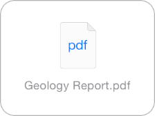

## 3.18 快速查看(Quick Look)
通过使用 Quick Look，用户可以在你的应用内预览文件，即使你的应用是打不开这个文件的。举例来说，你可以允许用户预览一些从网站上下载或从其他来源获得的文件。

想要学习如何在应用中加入 Quick Look 文件预览功能，请参阅 [Document Interaction Programming Topics for iOS](https://developer.apple.com/library/ios/documentation/FileManagement/Conceptual/DocumentInteraction_TopicsForIOS/Introduction/Introduction.html#//apple_ref/doc/uid/TP40010403).

在你的应用内预览文件之前，用户可在你定制的视图中查看该文件的信息。例如，用户从一封邮件中下载了附件之后，邮件应用(Mail)会在邮件中使用定制的视图展示文件的图标、标题和大小。用户可以通过点击它来预览文件。

你可以在应用中用一个新的视图来展示文件预览，或者使用全屏模态视图。展示的形式取决于你的应用运行在什么设备上。

**在 iPad 上使用模态视图来显示文件预览。**iPad 的大屏幕适合在一个方便用户离开的沉浸式环境中展示文件预览。缩放操作(zoom transition)很适合展示预览。

**在 iPhone 上使用专用的视图，最好是导航视图来显示文件预览。**这样可以使用户在应用情境中通过导航进入文件预览，不至于迷失。虽然也可以在 iPhone 应用中使用模态显示，但不推荐这样做。(注意缩放操作在 iPhone 上并不适用。)

另外要注意的是，在导航视图中显示文件预览意味着允许 Quick Look 在导航栏上放置特定的预览控件。(如果你的视图中包含工具栏，Quick Look 会将预览控件放在工具栏上。)