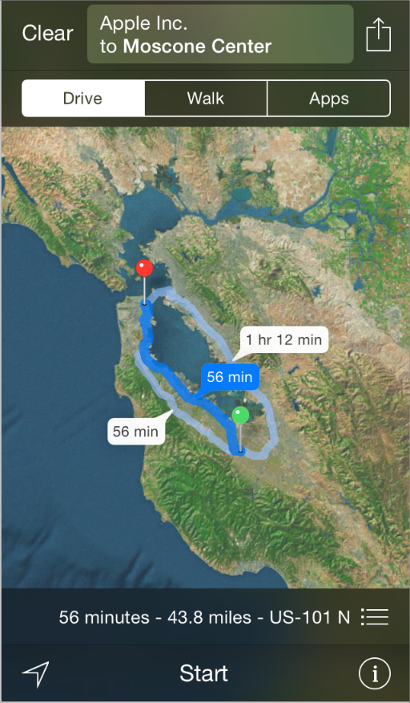
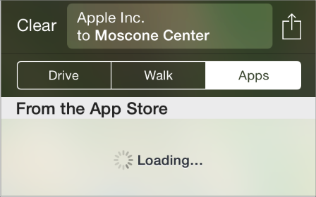

## 3.21 路线选择(Routing)
地图可以显示到达用户目的地的可选路线：

当人们想要获得关于某条路线的更多交通信息时，地图也可以显示能提供路线选择的应用列表(包括安装在设备上的应用也包括应用商店中的应用)。

**路线选择应用**可以提供当前选择的路线有关的信息。人们希望路线选择应用能够快捷、易用，特别是保证准确性。依据本章提供的指导原则能帮你为用户提供他们可信任的交通信息和他们期望的用户体验。

> 重要：地图能依据人们选择的路线给他们提供驾车和步行的指示。路线选择应用可以提供交通信息，它着重于使用交通工具(如公交车、火车、地铁、渡船、自行车、行人、穿梭巴士等)的模型替代实物逐步地指示方向。

如果你的应用不能提供用户指定的路线的交通信息，那么不要将你的应用定位为路线选择应用。

**实现你的应用所承诺的功能。**当人们在交通列表里看到你的应用时，他们认为它可以帮助其到达目的地。但是如果你的应用不能提供所选路线的信息，或者它没能涵盖它看似应该涵盖的那些种类的交通信息，人们就不会愿意给它第二次机会。准确的表达出你的应用的能力是十分重要的；否则，你的应用会看起来像是在故意误导用户。

在你的路线选择应用中，有两种主要的方式可以给用户信心：

- 尽可能准确的定义你所支持的地理区域。例如，如果你的应用能帮助人们获得巴黎的公交线路的信息，那你所支持的地区应该是巴黎，不是法兰西岛，也不是法国。
- 明确你所支持的交通信息类型。举个例子，如果你专攻于地铁信息，不要暗示你仿佛支持所有的轨道交通类型
> 注意：虽然准确的报告你所支持的地区可能意味着会减少你的应用在交通信息列表里的出现次数，但这么做却可以帮助用户更加信任它。

**为易用性合理组织界面。**易用性对于路线规划应用来说特别重要，因为用户常常会在极具挑战性的情况下使用它们——例如在明亮的阳光下、在昏暗的车厢内抑或是在颠簸的旅程中，或在非常紧急的情况下。要确保你的文字在任何光照条件下都能容易的阅读，确保按钮即使在并不平稳的旅程中也能易于准确点击。

**专注于路线。**虽然辅助信息会很有用，但你的应用应该专注于为用户提供逐步的指示以便他们能据此到达目的地。特别要强调的是，你要让用户知道他们处于哪一步，并知道如何到达下一步。你可以提供额外的数据(比如时间表或系统地图)，但不要让这些数据比交通信息还重要。

**为路线的每一步提供信息。**永远不要让用户感觉被你的应用所遗弃。即使在可以准确的报道你所支持的地区时，你也不能假定用户已经抵达的路线中的第一个交通节点或是最后一个交通节点就是他们目的地点。为了控制这一情况，首先就是测量起点到终点距离。如果距离足够短，要提供从用户当前位置到第一个交通节点及从最后一个交通节点到用户目的地的步行方向指示。如果步行不是一个合理的选择，尝试描绘用户的其他选项。如果必要的话，你可以给用户提供打开地图，获取这部分路线的步行或驾车方向指示的方式。

**当用户从地图应用切回你的应用时，不要要求他们重复输入信息。**如果用户从地图应用切入(你的应用)时，你已经获知了他们中意的起点与终点，因此你可以在应用打开时直接呈现适合的交通信息。如果用户从主屏幕中开启你的应用，要为他们提供简洁的方式用以输入路线详情。

**显示图文并茂的交通信息。**地图页面可以帮助人们以更大的、实物性的视角查阅他们完整的线路；清晰的步骤可以帮助人们专注于他们抵达目的地所需采取的必要行动。最好可以同时支持这两个任务并能让用户便捷地进行切换。

> 注意：无论以什么格式，最重要的是显示与用户线路相关的相同的交通信息。例如，如果路线中包含五个步骤，在地图和路线列表页中必须描绘相同的五步。

当你的应用被从交通列表中选中时，需要以显示完整的线路做为良好的开始(包括在地图页面中显示始于或抵达交通节点的步行路线)。地图页面可以为用户提供他们旅途的多步骤的总览，并能展示适于周遭地理环境的路线。

**用附加信息丰富地图页面。**人们期望你的应用中的地图可以表现的与他们使用过的其他地图相似。除了用户能放大和缩小以外，你还应该显示用户所需的那些注释信息。例如，你应该显示图钉用以代表用户当前的位置、目的地以及沿路的转乘点或重要的节点。

确保避免只显示一个单独的图钉，因为对用户来说，如果没有额外的背景，很难理解它代表什么。欲了解在你的应用中使用地图页面的更多信息，请参阅 [Map View](https://developer.apple.com/library/ios/documentation/userexperience/conceptual/mobilehig/ContentViews.html#//apple_ref/doc/uid/TP40006556-CH13-SW134).

尽可能地整合静态地图页面，例如在地图视图中加入地铁系统地图等。一个很好的实现方法就是在地图页面覆盖静态图片，以便用户可以看到他们的路线及他们的当前位置是如何与更大的交通系统相关联的。

> 注意：如果你决定让应用显示一个静态的地图图片，要确保使用高分辨率的图片以保证用户在缩放时维持高质量的显示。

**给用户提供不同的方案来挑选多样的交通选择。**很多因素会影响人们交通的选择，例如不同的时间段，天气以及他们携带东西的多少，所以提供简洁的不同交通方式的对比是十分重要的。例如，你要能让用户可以依据开始或结束的时间、需要步行的数量、沿途停下的次数抑或转乘的次数或所需的不同的交通类型等来挑选交通方式。不管你显示多种交通选择的顺序如何，确保用户能立即分辨出这些选项的不同之处。

**考虑使用推送通知为人们提供与路线相关的重要信息。**尽可能的让人们了解交通情况信息的变化，以便他们可以据此调节自己的计划。例如，如果火车晚点或者巴士路线临时停滞，人们可能会需要选择不同的交通路线到达目的地。而在一条不同步骤的站点之间相隔很长距离的交通路线中，人们会希望在他们的交通工具将要抵达行程中的下一部分时能获得通知。