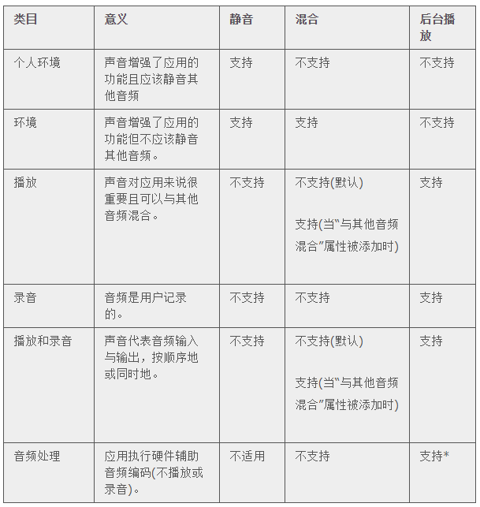

## 3.19 声音(Sound)
无论声音在你的应用中是主要体验的一环，还是锦上添花的元素，你都需要知道用户对声音表现的期望以及与如何满足这些期望。

### 3.19.1 理解用户期望(Understand User Expectations)
人们可以使用设备控件来调整声音，他们还可能使用有线或无线的耳机和听筒。人们也会对于他们的行为如何作用于他们听到的声音有各种各样的期望。虽然你可能会发现有一些期望很让人意外，但它们都会遵循用户控制的原则，即应是用户而非设备掌控听到声音的时机。

**用户会依据需要将设备静音：**

- 避免被突兀的音效打断，比如手机铃声和信息接收音等
- 避免听到用户操作所产生的副产品的声音，比如键盘或其他反馈音、偶然的声音或应用启动的声音
- 避免听到那些在玩游戏时非必要出现的声音，如音效和配乐
例如，在剧院中，用户将他们的设备调至静音以避免打扰剧院中的其他人。在这一情境下，用户仍然希望能在他们的设备上使用应用，但他们不希望被无预期或突兀的声音所打断，如手机铃声或新消息音。

当用户操作的明确目的就是听到声音时，铃音/静音开关(或静音开关)不会屏蔽这些操作所产生的声音。例如：

- 在仅有媒体播放功能的应用中的进行媒体播放是不会被静音的，因为播放媒体是用户明确期望的。
- 闹钟不能被静音，因为闹钟是用户明确设定使用的。
- 语言学习应用中的音效素材不能被静音，因为用户进行了明确的操作希望听到它。
- 音频对话应用中的对话不被静音，因为用户打开这个应用的唯一目的就是进行音频对话。
**用户使用设备音量调节按键可调节他们的设备所能发出的所有声音的音量，**包括歌曲、应用音效和设备声音。不管铃声/静音(或静音)的开关在什么位置，用户都能使用音量调节按键屏蔽所有声音，使用音量调节按键调节应用当前所播放的音频时同样调整了全局系统的音量，铃声音量除外。

 >对于 iPhone：当没有音频播放时使用音量键可以调整铃声音量。

**用户使用耳机的目的在于能够私密地收听声音以及解放他们的双手。**不管这些配件是有线的还是无线的，用户对这个体验都有特定的期待。

当用户插入耳机或连接无线音频设备时，他们期望能以私密的状态继续收听当前播放的音频。因此，他们希望应用能够不中断地继续播放当前正在播放的音频。

当用户拔出耳机或断开与无线设备的连接时(抑或设备超出范围或关闭时)，他们不希望他们刚刚收听的内容被自动地与他人分享。因此，他们希望正在播放音频的应用暂停播放，让他们能够在自己想要继续播放的时候再开启。

### 3.19.2 定义应用的音频行为(Define the Audio Behavior of Your App)
**如果必要的话，你可以通过调整相关的、独立的音量水平以在你的应用中制造最好的混音输出效果。**但最终音效输出的音量也应该能由系统音量控制，可以通过音量键或音量滑块进行调节。这意味着应用的音频输出的控制权仍然归属在用户手中。

**确保你的应用能适时地显示音频路径选择。**(音频路径(audio route)是指音频信号的电子通路，例如从设备到耳机或是从设备到扬声器。)即使人们没有物理性的插入或拔出音频设备，他们也仍希望能选择其他不同的音频路径。为了实现这一诉求，iOS 能自动显示可让用户选择输出音频路径的控件(使用 [MPVolumeView](https://developer.apple.com/library/ios/documentation/MediaPlayer/Reference/MPVolumeView_Class/index.html#//apple_ref/occ/cl/MPVolumeView) 类能允许这个控件显示在你的应用中)。由于选择不同的音频路径是用户主动的行为，用户期望当前播放的音频能继续不中断。

**如果你需要显示音量滑块，**在使用 [MPVolumeView](https://developer.apple.com/library/ios/documentation/MediaPlayer/Reference/MPVolumeView_Class/index.html#//apple_ref/occ/cl/MPVolumeView) 类时，确保使用的是系统提供的可用的音量滑块。注意，当正在使用的音频输出设备不支持音量控制时，音量滑块会被合适的设备名称所替代。

**如果你的应用只产生一些与其功能无必要关系的界面音效时，(尽量)使用系统音效服务(System Sound Services)。**系统音效服务是一种能产生警示音、界面音效和发出振动的 iOS 技术；它不适合任何其他用途。当你使用系统音效服务(System Sound Services)来产生音效时，你不能干涉你的音频与设备的音频的交互方式，也不能干涉它处理干扰和设备配置变化的方式。想了解如何使用这一技术，请参阅 [Audio UI Sounds (SysSound)](https://developer.apple.com/library/ios/samplecode/SysSound/Introduction/Intro.html#//apple_ref/doc/uid/DTS40008018)中的范例项目。

**如果音效在你的应用中扮演重要的角色，使用音频会话服务(Audio Session Services)**或是 [AVAudioSession](https://developer.apple.com/library/ios/documentation/AVFoundation/Reference/AVAudioSession_ClassReference/index.html#//apple_ref/occ/cl/AVAudioSession) 类。这些程序接口不产生音效；相反，它们会帮助你了解你的音频应该如何与设备的音频进行交互以及如何响应设备配置的干扰与变化。

> 对于 iPhone：无论你使用什么样的技术来制作音频，无论你如何定义来它的行为，电话总是可以中断当前运行的应用。这是因为任何应用都不应该阻止人们接收来电。

在音频会话服务(Audio Session Service)中，音频会话(audio session)执行了你的应用与系统之间音频中介的功能。音频会话中最重要的方面之一就是类目(category)，它定义了你的应用的音频行为。

为了实现音频会话服务带来的好处并提供用户期望的音频体验，你需要选择可以完美描述应用音频行为的类目(category)。具体情况取决于你的应用只在前台播放音频还是也要在后台播放音频。在你做这一选择的时候，遵循以下这些原则：

- **依据其语义而非精确的行为来选择音频会话类目。**通过选择目的清晰的类目，你可以确保你的应用能表现得符合用户期望。除此之外，当以后行为的精确集合被重新定义时，它可以为你的应用提供最佳的机会使其合理运行。
- **在极少数情况下，可以添加属性到音频会话中以修正一个类别的标准行为。**一个类别的标准行为代表多数用户的期望，因此在你改变那个行为之前你应该仔细地考虑。例如，你可以添加闪避(ducking)属性以确保你的音频声音能比其他所有的音频都大(除了电话音频)，如果这就是用户所期望的。(欲了解更多关于音频会话属性的内容， 请参见的 [Fine-Tuning the Category](https://developer.apple.com/library/ios/documentation/Audio/Conceptual/AudioSessionProgrammingGuide/AudioSessionBasics/AudioSessionBasics.html#//apple_ref/doc/uid/TP40007875-CH3-SW2)。)
- **依据设备当前的音频环境来考虑你的类目选择。**这应该是合理的，举个例子，用户可以在使用你的应用的同时听其他音频而非你的配乐。如果要这样做，须确保避免当你的应用启动时，迫使用户停止收听当前的内容或要需要额外地在两者之间做出选择。
- **通常情况下，避免在你的应用运行时改变类目。**改变类目的首要依据是你的应用是否需要在不同的时机支持录音和播放。在这种情况下，更好的选择是依据需要在录音类目与播放类目之间转换，而非同时选择播放和录音类目。这是因为选择录音类目可以确保正在录音时不会听到提示音，比如收到信息的提示音。
表35-1列举了你可以使用的音频会话类目。不同的类目可以允许通过铃声/静音开关或静音开关(或设备锁)来实现静音、与其他的音频混合或者控制应用在后台播放。(欲了解编程界面上所呈现的类目和属性的准确名称，请参见 [Audio Session Programming Guide](https://developer.apple.com/library/ios/documentation/Audio/Conceptual/AudioSessionProgrammingGuide/Introduction/Introduction.html#//apple_ref/doc/uid/TP40007875).)

表35-1 音频会话类目及其相关行为

*如果你选择音频处理类目并且你希望在后台运行音频进程，你需要在完成音频处理之前防止你的应用被暂停。欲了解如何实现这一功能，参见[《iOS 应用编程指南》](https://developer.apple.com/library/ios/documentation/iPhone/Conceptual/iPhoneOSProgrammingGuide/Introduction/Introduction.html#//apple_ref/doc/uid/TP40007072)中的执行长时间运行的后台任务。

以下是一些示例情境，其中指示了如何选择音频会话类目以提供用户喜欢的音频体验。

**情境1：一个帮助人们学习新语言的教育类应用。**你需要提供：

- 用户点击特定控件时播放反馈音效
- 当用户想听到正确发音的示例时播放字词的录音
在这个应用中，声音对于主要功能是十分重要的。人们使用这个应用来听他们正学习的语言的词语与短语，因此即使当设备锁定或者被调至静音时也要能播放声音。因为用户需要清晰地听到声音，他们会期望其他他们可能播放的音频都被静音。

为了满足用户对于该应用所期望的音频体验，你应该使用播放(Playback )类目。虽然这一类目可以被定义为与其他音频混合，但该应用应该使用默认的行为以确保其他的音频不会干扰那些用户明确选择听到的教育性内容。

**场景2：网络协议电话(VoIP)应用。**你需要提供：

- 接收音频输入的能力
- 播放音频的能力
在该应用中，声音对于主要功能是十分重要的。人们经常会在使用另一个应用时使用该应用与他人进行交流。用户期望能在他们将设备调至静音或设备被锁定时接听电话，他们希望在来电期间其他音频被静音。他们也希望应用在后台运行时也能继续打电话。

为了满足用户对于该应用所期望的音频体验，你应该使用播放和录音(Play and Record)类目，并且你要确保只有在你需要时才会激活你的音频会话，以便用户可以在打电话过程中使用其他音频。

**场景3：允许用户在不同任务中操作角色的游戏。**你需要提供：

- 不同的游戏运行音效
- 配乐
在该应用中，声音会在很大程度上提升用户体验，但对于主任务并没有那么重要。而且，用户可能会希望能在玩游戏时静音或听他们乐单中的歌曲而不听游戏配乐。

最好的策略是在你的应用启动时确定用户是否在收听其他音频。不要要求用户选择他们是要收听其他音频或是你的音效。而应该使用音频会话功能中的 [AudioSessionGetProperty](https://developer.apple.com/library/ios/documentation/AudioToolbox/Reference/AudioSessionServicesReference/index.html#//apple_ref/c/func/AudioSessionGetProperty) 来请求 [kAudioSessionProperty_OtherAudioIsPlaying](https://developer.apple.com/library/ios/documentation/AudioToolbox/Reference/AudioSessionServicesReference/index.html#//apple_ref/c/econst/kAudioSessionProperty_OtherAudioIsPlaying) 属性的状态。依据所请求的答案，你可以选择环境(Ambient)或是个人环境(Solo Ambient)类目(这两种类目都允许用户静音玩游戏)：

- 如果用户正在听其他音频，你应该假设他们想要继续听并且不想被强迫收听游戏音效。在这种情境下，你最好选择环境(Ambient)类目。
- 如果用户在你的应用启动时没有在收听其他音效，你最好选择个人环境(SoloAmbient)类目。
**情境4：一个为用户到达目的地提供准确、实时导航指示的应用。**你需要提供：

- 路途中每一步的语音指示
- 一些反馈音效
- 支持用户继续收听他们自己的音频的能力
在该应用中，无论应用是否是在后台运行，语音导航指示都表现为主要任务。基于这一原因，你最好使用播放(Playback)类目，它允许你的音频在设备被锁定、静音或是在后台运行时仍可以播放。

你可以通过添加 [kAudioSessionProperty_OverrideCategoryMixWithOthers](https://developer.apple.com/library/ios/documentation/AudioToolbox/Reference/AudioSessionServicesReference/index.html#//apple_ref/c/econst/kAudioSessionProperty_OverrideCategoryMixWithOthers) 属性来实现允许人们在使用你的应用时收听其他音频。但是你也想要确保用户在他们正在播放其他音频时能听到语音提示。你可以为音频会话添加 [kAudioSessionProperty_OtherMixableAudioShouldDuck](https://developer.apple.com/library/ios/documentation/AudioToolbox/Reference/AudioSessionServicesReference/index.html#//apple_ref/c/econst/kAudioSessionProperty_OtherMixableAudioShouldDuck) 属性来确保你的音频比其他音频的声音更大( iPhone 上的电话音频除外)。这些设置允许应用在后台运行时也可以恢复音频会话，可以确保用户能获得实时更新的导航。

**情境5：一个允许用户上传文本和图片到网站上的博客应用。**你需要提供：

- 简短的启动音效文件
- 伴随用户行为产生的各式各样的短音效(例如当邮件被上传后播放的音效)
- 发送失败时播放的提示音
在该应用中，声音提升了用户体验，但也不是必需的。主任务与音频并没有关系，用户也不是必须要通过收听声音才能成功使用应用。在这一情境中，你最好使用系统声音服务来产生声音。这是因为这个应用中所有声音的音频情境都符合本技术想要达到的目的，也就是说应制作符合用户所期待的、能通过设备和铃声/静音(或静音)开关来调节的界面音效和提示音。

### 3.19.3 管理音频中断(Manage Audio Interruptions)
有时候，当前播放的音频会被来自于不同应用的音频所打断。举个例子，在 iPhone 上，来电会持续中断当前应用的音频。在多任务情境中，这种音频中断的频率可能会很高。

为了提供用户喜欢的音频体验，iOS 系统依赖于你能做到下面几点：

- 识别可能会引起应用中断的音频类型
- 当应用在音频中断结束后继续运行时进行合理地反馈
每个应用需要识别会引起音频中断的类型，但不是每个应用都需要决定如何在音频中断结束后进行反馈。这是因为多数类型的应用应在音频中断结束后恢复音频。只有那些主要或部分由媒体播放组成(以及提供媒体播放控制)的应用，才必须用额外的步骤来决定什么是合适的反馈。

从概念上讲，基于中断当前音频的音频类型以及中断结束后用户所期望的特定的应用反馈方式，有两种类型的音频中断：

- **可恢复性中断是(resumable interruption)**被用户视为临时穿插在他们的主要聆听体验中的音频引起的。
在可恢复性中断结束后，有媒体播放控件的应用应该恢复它被中断前的任务，无论是继续播放音频还是保持暂停。没有媒体播放控件的应用则应该恢复播放音频。

举个例子，试想用户在 iPhone 上使用应用播放音乐时，在播一首歌的中间来了一个网络电话。用户接起了电话，期望在他们通话时播放的应用能静音。在通话结束后，用户希望播放的应用自动恢复播放歌曲，因为音乐而非电话才是他们的主要聆听体验，而他们在电话接入前也没有暂停音乐。另一方面，如果用户在电话接入前暂停了音乐播放，他们会希望电话结束后音乐仍保持暂停。

其他能引起可恢复性中断的应用的例子还有那些具备闹钟、音频提示(例如语音方向指示)或其他间歇性音频功能的应用。

- **不可恢复中断(nonresumable interruption)**是由那些被用户视为首要听觉体验的音频所引起的，比如媒体播放产生的音频。在不可恢复中断结束后，显示媒体播放控件的应用不应该恢复播放原来的音频。而没有媒体播放控件的应用应该恢复播放音频。例如，假设用户正在收听一个音乐播放应用(音乐应用1)，此时另一个音乐播放应用(音乐应用2)打断了它。用户终止后决定收听音乐应用2一段时间。在退出音乐应用2之后，用户不想要音乐应用1自动恢复播放，因为此时他们主动将音乐应用2作为首要的听觉体验。
下面的指南可以帮助你决定当一个音频中断后如何继续以及提供什么信息:

**确定由你的应用引起的音频中断的类型。**在你的音频结束时，你可以通过以下任意一种方式去禁用你的音频会话来做到这一点：

- 如果你的应用引起了一个可恢复性中断，使用 [AVAudioSessionSetActiveFlags_NotifyOthersOnDeactivation](https://developer.apple.com/library/ios/documentation/AVFoundation/Reference/AVAudioSession_ClassReference/index.html#//apple_ref/c/econst/AVAudioSessionSetActiveFlags_NotifyOthersOnDeactivation) 标识禁用你的音频会话。
- 如果你的应用引起了一个不可恢复中断，不用任何标识就可以禁用你的音频会话。
无论提供与否，标识会在适宜的情况下允许iOS系统赋予被中断的应用自动恢复播放它们的音频的能力。

**决定是否应该在一个音频中断结束后恢复音频。**你应依据你应用中所提供的音频体验来做这一决断。

- 如果你的应用给用户呈现了用于播放或暂停音频的媒体播放控件，你需要在一个音频中断结束后检查AVAudioSessionInterruptionFlags_ShouldResume标识，如果你的应用接受应该恢复(Should Resume)标识，你的应用应该：
- 恢复播放音频(你的应用被打断时在主动播放音频)
 - 不恢复播放音频(你的应用被打断时没有在主动播放音频)
- 如果你的应用没有呈现任何用户可用于播放或暂停音频的媒体播放控件，你的应用无论是否有“应该恢复”标识，都始终应在音频中断结束后恢复之前播放的音频。例如，播放配乐的游戏应该在被中断后自动恢复播放配乐。
### 3.19.4 适时处理媒体远程控制事件(Handle Media Remote Control Events, if Appropriate)
当人们使用 iOS 媒体控制器或辅助控制器(如耳机线控)时，应用要能响应远程控制。使你的应用能接收来自于你的用户界面之外的输入，无论你的应用当前是在前台还是后台播放音频。

应用可以在播放媒体的过程中，通过后台向支持 Airplay 的硬件(如 Apple TV)发送视频。这样的应用可以接收通过远程控制事件实现的用户输入行为，因此用户可以控制处于后台运行状态的应用中的视频播放。除此之外，这类应用在后台运行时也能恢复被中断的音频。

当一个媒体播放应用在后台播放音频或视频时，尤其需要合理响应媒体远程控制事件。

当你的应用在后台运行时，为了满足与播放媒体特权相关的责任，要确保遵循以下这些原则：

**限制你的应用接收远程控制事件的次数。**例如，当你的应用可以帮助用户阅读内容、搜索信息或是收听音频时，它只有在用户处于音频场景中时才应该接收远程控制事件。当用户脱离音频情境时，你应该放弃接收事件的能力。如果你的应用允许用户在支持 AirPlay 的设备上播放音视频，它应该在媒体播放期间都可以接收远程控制事件。遵循这些原则能使用户在你的应用中处于非媒体情境中时，通过耳机控制获得另一个应用的媒体体验。

**尽可能地使用系统原生的控件以提供 AirPlay 支持。**当你使用 [MPMoviePlayerController](https://developer.apple.com/library/ios/documentation/MediaPlayer/Reference/MPMoviePlayerController_Class/index.html#//apple_ref/occ/cl/MPMoviePlayerController) 类实现 AirPlay 播放功能时，你可以利用标准的控件使用户可以选择当前范围内支持 AirPlay 的硬件。或者你可以使用 [MPVolumeView](https://developer.apple.com/library/ios/documentation/MediaPlayer/Reference/MPVolumeView_Class/index.html#//apple_ref/occ/cl/MPVolumeView) 类来显示用户可选择的支持 AirPlay 的音频或视频设备。用户习惯于这些标准控件的外观和行为，因此他们可以理解如何在你的应用中使用它们。

**不要改变事件的用途，即使这个事件在你的应用中没有意义。**用户期望 iOS 系统的所有应用媒体控制和辅助控制能有功能上的统一。你不必实现你的应用所不需要的那些事件，但你所实现的事件必须产生符合用户期望的结果。如果你重新定义一个事件的意义，你会使用户困惑并冒险把他们带入一个未知的状态，他们只能通过退出你的应用来逃离。