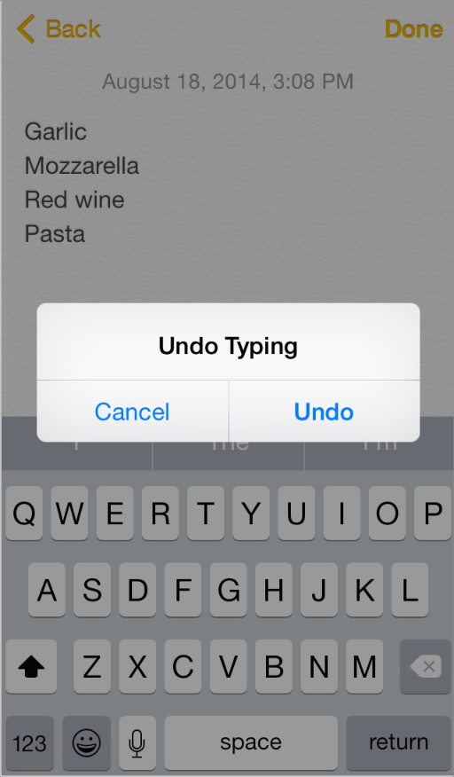
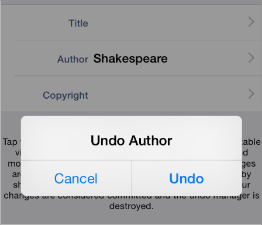

## 3.23 撤销与重做(Undo and Redo)
用户通过摇晃设备触发撤销操作，显示提醒框让他们可以：

- 撤销他们刚才输入的内容
- 重做先前撤销的输入
- 取消撤销操作

你可以通过在你的应用中定义出更通用的方式来支持撤销操作：

- 允许用户撤销或重做的行为
- 在你的应用的哪种情形下晃动手势是用于撤销操作的
- 支持多少步的撤销
欲了解如何用代码实现这一行为，请参阅 [Undo Architecture](https://developer.apple.com/library/ios/documentation/Cocoa/Conceptual/UndoArchitecture/UndoArchitecture.html#//apple_ref/doc/uid/10000010i).如果在你的应用中支持撤销和重做，请遵循以下准则以提供好的用户体验:

**为用户提供简洁的描述性短语使其能准确的获知他们正在撤销或重做的内容。**iOS 系统自动提供了“撤销”和“重做”的字符串(包括词语后面的空格)作为撤销警示按钮的标题，但你需要提供一或两个词语用于辅助描述用户的重做或撤销操作。例如，你可能提供文本的“命名”或“地址更改”之类的词语用以创建像“撤销命名”或“重新更改地址”这样的按钮标题。(要注意，在提醒框中，“取消”按钮是不能改变或移除的)。

**避免提供的文本过长。**太长的按钮标题容易被断章取义并且很难被用户解读。由于这个文本用于按钮的标题中的，要使用标题样式的大写形式并且不能添加标点。

**避免过度使用摇晃手势。**即使你能程式化地设定你的应用将摇晃事件作为用户激活撤销操作的途径，你也在冒着混淆用户视听的风险，因为他们也可能使用摇晃执行另一个不同的操作。分析你应用中的人机交互以避免创建那些用户无法可靠地预测摇晃手势结果的场景。

**如果撤销和重做在你的应用中是基础性的任务，尽量使用系统原生的撤销与重做按钮。**记住摇晃手势是用户触发撤销与重做操作的主要方式，而如果提供两种不同方式完成同样的任务则会使用户困惑。如果你认为很有必要提供直观专有的撤销与重做操作，你可以在导航栏中放置系统原生的按钮。(欲了解更多关于这些按钮的信息，参见 [Toolbar and Navigation Bar Buttons](https://developer.apple.com/library/ios/documentation/userexperience/conceptual/mobilehig/Bars.html#//apple_ref/doc/uid/TP40006556-CH12-SW33)).

**将撤销与重做能力与用户当下的情境进行清晰地关联，而非过早地介入情境。**仔细考虑你允许进行撤销与重做操作的情境。通常来说，用户期望他们的改变和操作可以立即被有效的执行。