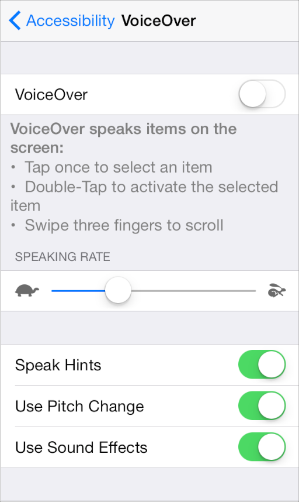

## 3.20 VoiceOver
VoiceOver 增加了对盲人、弱视用户以及一些有特定学习困难的用户的可用性。

为了确保 VocieOver 的用户能使用你的应用，你需要在你的用户界面中提供一些有关视图和控件的描述信息。对 VoiceOver 的支持不需要你改变你用户界面内的任何视觉设计。

当你完全遵照标准的方式使用标准的用户界面元素时，几乎不(即使有也很少)需要增加额外的工作。你的用户界面越趋向定制化，你就越需要提供更多的信息来保证 VoiceOver 能准确的描述你的应用。

增加你的 iOS 应用对 VoiceOver 用户的可用性，可以扩大你的用户基础并帮助你进入新的市场。支持 VoiceOver 也可以帮助你遵守由主流群体所制定的可用性指导准则。